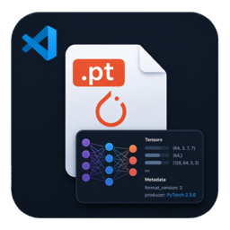

# Torch checkpoint inspector

  

Inspect `.pt` / `.pth` in a custom editor. Needs Python with **PyTorch**; **pandas** / **numpy** if checkpoints embed DataFrames. Interpreter: `torchCheckpointInspector.pythonPath`, else Python extension, else `python3`. Optional `torchCheckpointInspector.allowUnsafeLoad` (trusted files only).

**Install:** [Visual Studio Marketplace](https://marketplace.visualstudio.com/items?itemName=gelbhart.vscode-torch-checkpoint-inspector) · [Open VSX](https://open-vsx.org/extension/gelbhart/vscode-torch-checkpoint-inspector) (Cursor / VS Code–OSS).
